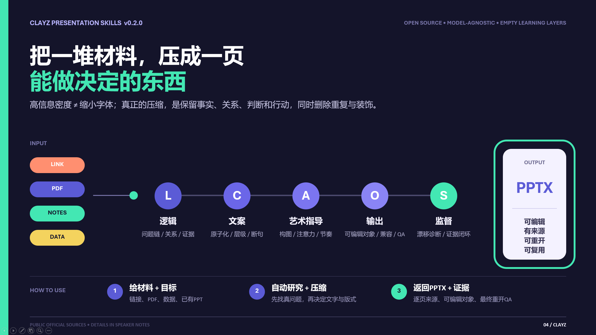
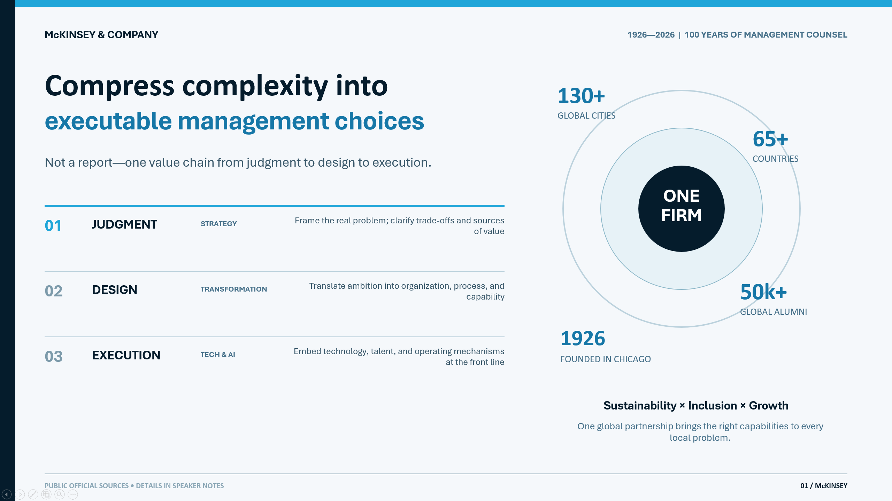
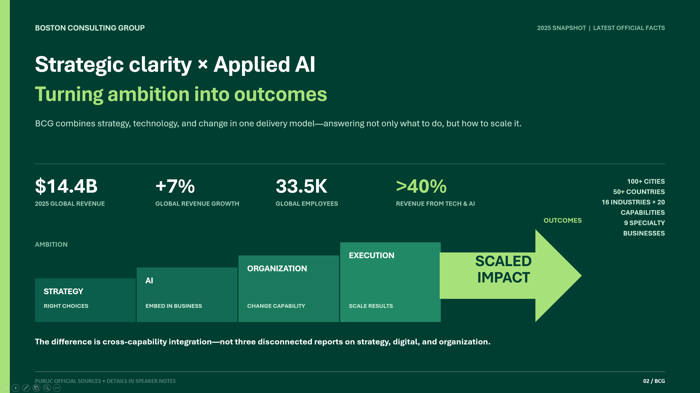

# Clayz Presentation Skills

[English](README.md) | [简体中文](README.zh-CN.md)

[](https://github.com/clayzwang/clayz-presentation-skills/actions/workflows/ci.yml) · Current release: **v0.3.0**

**Compress complex material into presentation-ready decisions — with logic, copy, art direction, editable output, and final QA in one governed workflow.**



## Built for real presentation work

The same system can adapt its visual language to the task while preserving hierarchy, evidence, and editability.






> Showcase slides demonstrate presentation-generation capability and visual adaptation. Brand names shown in examples belong to their respective owners and do not imply affiliation or endorsement.

**[Explore the interactive Experience Center →](https://clayzwang.github.io/clayz-presentation-skills/)**

Clayz Presentation Skills is an open, five-stage system for producing evidence-based presentations:

1. **Logic** establishes the question chain, claims, evidence, and cross-slide invariants.
2. **Copy** locks every visible word, number, break, and atomic copy unit.
3. **Art Direction** turns approved copy into a visual plan without changing content.
4. **Output** builds an editable presentation against the approved plan.
5. **Supervisor** audits drift and evidence without silently redesigning the deck.

## Capability upgrade in this iteration

This is not a larger pile of layout rules. It gives Art Direction a stronger repertoire while keeping every move accountable to the current content:

- **Content-aware composition:** image-led slides must inspect subject protection, usable copy zones, crop, contrast, directional flow, and overlay necessity before placing text. A remembered advertising layout is never accepted as the answer by itself.
- **Template and icon grammar:** templates, charts, tables, icons, and sample decks enter as reviewed candidates. The plan must re-derive the composition from Logic and Copy, explain every selected asset's semantic role, keep icon-family decisions coherent, and record source and license evidence.
- **Reference-architecture synthesis:** Art Direction ships a validated index of 76 distinct official, diagram-bearing documents from ten publishers and a bilingual 16-card relationship-pattern library. An eight-step method moves from problem framing and source selection through relationship extraction, pattern combination, task-specific derivation, slide translation, diagnosis, and a traceable research ledger—without importing a vendor master.
- **Flexible judgment under contract:** the Art Direction plan v1.4 fixes the evidence and decisions that must be explicit, not coordinates, icon counts, fill ratios, or aesthetic scores. Rendered A/B evidence and professional judgment remain decisive.
- **Fixed regression:** eleven synthetic cases cover four material routes, four cross-slide behaviors, content-aware image composition, governed asset selection, and reference-architecture houses. Tests reject image-led pages without canvas evidence, selected assets without license records, and noun-only houses without responsibility or feedback.

The public repository still bundles no third-party template, master, icon set, poster, dataset, model, or media. The capability is to retrieve, judge, re-compose, and attribute admissible material—not to clone a source library.

## Project lineage

The five-stage workflow and its first five core capabilities were independently designed and implemented under the **clayz** brand before the project reviewed PPT Master or the other sources listed below. After that foundation was working, Clayz entered an open-learning phase and selectively integrated ideas from multiple open-source and research projects.

[PPT Master](https://github.com/hugohe3/ppt-master) is therefore a later-stage reference—not the origin, fork base, or foundation of this repository. File-level attribution remains governed by the exact provenance and redistribution records under `provenance/`.

## Design principles

- Keep reasoning and visual production as separate approval stages.
- Treat models as capable decision makers; use contracts and scripts only where determinism matters.
- Keep themes, fonts, renderers, reference providers, delivery profiles, and attribution in one central configuration file.
- Never let automated scores replace business, editorial, or visual judgment.
- Preserve editability, source traceability, and final rendered evidence.

## Repository layout

- `skills/` contains the five focused skills.
- `config/default.json` is the single public configuration source.
- `packages/validators/` contains shared deterministic validators.
- `packages/contracts/` contains versioned cross-stage contracts.
- `packages/layout/` contains the original renderer-neutral relative-layout solver.
- `packages/adapters/` contains optional, separately installed renderer adapters.
- `knowledge/` contains the empty portable learning, source, and index scaffold.
- `examples/` contains synthetic examples only.
- `experience/` contains isolated public-output evidence for the GitHub Pages experience; it is never admitted into the knowledge or reference corpus.
- `provenance/` records conceptual influences and redistributed dependencies.
- `VERSION` is the single release-version source of truth; `scripts/validate_version.py` rejects drift across metadata and public surfaces.

Release maintainers should use `python scripts/prepare_release.py X.Y.Z --date YYYY-MM-DD` instead of editing version strings individually. Merging the resulting `VERSION` change triggers a guarded GitHub Release. See [`docs/releasing.md`](docs/releasing.md).

## Quick start

Clone the complete repository so the five skills keep access to their shared configuration, contracts, validators, and empty knowledge scaffold:

```bash
git clone <your-repository-url> clayz-presentation-skills
cd clayz-presentation-skills
python -m pip install -r requirements.txt
python scripts/validate_all.py
```

Register or expose the five directories under `skills/` to your agent host. Start with Logic and pass each approved artifact to the next stage. Preserve the repository-relative paths; copying one skill directory by itself removes its shared configuration and contracts. Do not skip Supervisor for a final deliverable.

Validate the repository:

```bash
python -m pip install -r requirements.txt
python scripts/validate_all.py
```

Resolve the fully synthetic layout-tree fixture:

```bash
python packages/layout/solve_relative_layout.py \
  examples/synthetic-business-review/layout-tree.json \
  /tmp/resolved-layout.json
```

The experimental PptxGenJS route is isolated under `packages/adapters/pptxgenjs/`. It is syntax-checked but security-blocked by default because its current upstream dependency chain contains unpatched denial-of-service advisories; see its README before any evaluation.

Stamp non-visible clayz provenance into a generated PPTX:

```bash
python scripts/stamp_pptx_metadata.py deck.pptx --config config/default.json
```

The metadata stamp is documented, removable, and contains no tracking identifier or network behavior.

Remove only the Clayz-owned custom properties while preserving unrelated document metadata:

```bash
python scripts/stamp_pptx_metadata.py deck.pptx --config config/default.json --remove
```

## Runtime expectations

- The core scripts require Python 3.10 or later. Pillow supports raster, rhythm, and size inspection; PyYAML validates the machine-readable provenance manifest.
- GitHub Actions tests Python 3.10, 3.11, and 3.12 and starts every public command-line entry point with `--help` before release.
- Producing PPTX files requires a compatible agent host or a separately supplied backend such as a native presentation tool, PptxGenJS, or python-pptx.
- Full production QA requires a renderer that can reopen and render the written PPTX, such as PowerPoint, WPS, or LibreOffice.
- This repository provides skills, contracts, centralized configuration, validators, a local knowledge runtime, a relative-layout solver, an execution ledger, metadata tooling, and one disabled experimental editable-object adapter. It is not a standalone one-command model runner.
- MCP is optional. A capable model host can read the skills and call local tools directly; add MCP only when you want a portable interface to remote storage, search, rendering, or another external service.

## Language routing

`config/default.json` defaults to `en-US` and supports `zh-CN`. Every deep reference has an English base file such as `references/example.md` and a matching Chinese file such as `references/example.zh-CN.md`. Each skill resolves the task locale first and loads one language only, unless the user explicitly requests translation comparison. Generated deck language remains a task-level choice; it is not forced by the documentation language.

## Knowledge, learning, and reference index

The public repository includes an intentionally empty portable scaffold under `knowledge/`:

- four learning areas for Logic, Copy, Art Direction, and Output;
- one shared source tree organized by file type;
- empty asset and human-admission registries;
- stage navigation that defines retrieval, writeback, and promotion boundaries.

Supervisor has no separate learning silo. It returns reusable observations to the responsible stage. Generated artifacts, automated scores, usage counts, and Supervisor opinions never become approved references automatically.

Downloading the repository does not create, read, or connect a ChatGPT Library. The default provider is the local filesystem. A host-specific adapter may map the same structure to ChatGPT Library or another storage system, but no such adapter is bundled or required. See [`knowledge/README.md`](knowledge/README.md) and [`knowledge/registry/schema.md`](knowledge/registry/schema.md).

The scaffold is operational in v0.2.0: `scripts/knowledge_cli.py` can register, separately admit, index, search, and record observations. Unadmitted or hash-changed sources are excluded. See [`docs/knowledge-runtime.md`](docs/knowledge-runtime.md).

## Public growth boundary

v0.2.0 adds reusable engineering capability, not someone else's “humanity.” The core skills, synthetic examples, and knowledge scaffold intentionally ship no admitted real cases, taste corpus, personal preference profile, learned corporate style, template, or master. Isolated public-data output evidence may appear under `experience/`, but it is never promoted into the knowledge or reference corpus. Each user may build those layers through the governed knowledge scaffold. The deliberately excluded technologies and the exact adopted/not-adopted boundary are documented in [`docs/source-adoption.md`](docs/source-adoption.md).

## Configuration

Edit or override `config/default.json`. Do not hard-code organization brands, master files, fonts, local paths, or renderer names inside a skill.

The core package intentionally includes no uploaded master, private presentation, PDF, font, or derived corporate reference asset. The example under `examples/` remains fully synthetic. Public-data screenshots and presentations under `experience/` are output evidence only and are governed by `experience/case-manifest.json` plus release-hygiene scanning.

Release validation accepts an optional, untracked denylist through `CLAYZ_RELEASE_DENYLIST` or `scripts/check_release_hygiene.py --denylist`. Keep organization-specific names and source-material phrases in that local file, never in the public repository.

For GitHub CI, store the UTF-8 denylist as a base64-encoded repository secret named `CLAYZ_RELEASE_DENYLIST_B64`. The workflow decodes it only on the runner and never commits the terms. Before a public release, also enable GitHub private vulnerability reporting as described in [`SECURITY.md`](SECURITY.md).

## Influence citations

Later-stage conceptual influences are identified at the exact reference points inside the skill documentation and summarized in `provenance/manifest.yaml`. With thanks to the authors and contributors of [PPT Master](https://github.com/hugohe3/ppt-master), [PPTAgent](https://github.com/icip-cas/PPTAgent), [DeepPresenter](https://arxiv.org/abs/2602.22839), [pom](https://github.com/hirokisakabe/pom), [VASCAR](https://arxiv.org/abs/2412.04237), [PosterO](https://openaccess.thecvf.com/content/CVPR2025/html/Hsu_PosterO_Structuring_Layout_Trees_to_Enable_Language_Models_in_Generalized_CVPR_2025_paper.html), [PosterLayout](https://arxiv.org/abs/2303.15937), [Scan-and-Print](https://arxiv.org/abs/2505.20649), [CreatiPoster](https://arxiv.org/abs/2506.10890), and [PptxGenJS](https://github.com/gitbrent/PptxGenJS). Exact revisions, licenses, citation-only constraints, and non-redistribution boundaries are recorded; no upstream source snapshot, prompt, template, reference slide, media, dataset, or model is bundled.

For the reference-architecture synthesis method, Clayz also thanks the architects, technical writers, designers, engineers, and reviewers behind [IBM Think Architectures](https://www.ibm.com/think/architectures), [Microsoft Azure Architecture Center](https://learn.microsoft.com/en-us/azure/architecture/), [Google Cloud Architecture Center](https://cloud.google.com/architecture), [AWS Architecture Center](https://aws.amazon.com/architecture/), [Oracle Architecture Center](https://docs.oracle.com/solutions/), [SAP Architecture Center](https://architecture.learning.sap.com/), [NVIDIA Enterprise Reference Architectures](https://docs.nvidia.com/enterprise-reference-architectures/), [Databricks reference architectures](https://docs.databricks.com/aws/en/lakehouse-architecture/reference), [Snowflake architecture guidance](https://www.snowflake.com/en/developers/guides), and [Apple Platform Security](https://support.apple.com/guide/security/welcome/web). The index records links and distilled relationships only; no source diagram, wording, icon, brand identity, master, template, coordinate system, or media is redistributed.

## License and citation

Licensed under Apache-2.0. See `NOTICE`, `CITATION.cff`, and `provenance/THIRD_PARTY_NOTICES.md`.

